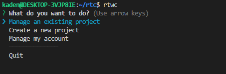
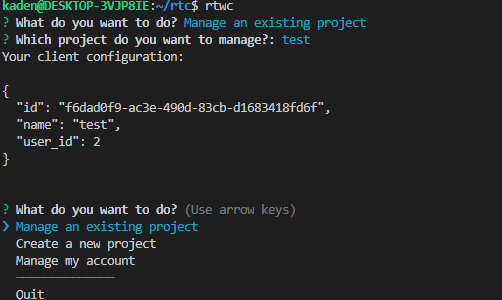

# Realtime Web Components

## Usage Guide

### Prereqs

* Unix system (Linux, MacOS, WSL, etc.)
* `npm`

### Setup

1. Install configuration cli `sudo npm install rtwc@0.0.7 --global` 
2. run rtwc in your command line 




3. create an account 
4. create a project and view its config'



5. install the web components dependency into your react project with `npm i react-realtimewebcomponents`

6. configure your react project `index.js` and make the configuration available like so:

```javascript
import {RTContext} from 'react-realtimewebcomponents/dist/rtInit'

const config ={
  id: "f6dad0f9-ac3e-490d-83cb-d1683418fd6f",
  name: "test",
  user_id: 2
}

ReactDOM.render(
  <React.StrictMode>
    <RTContext.Provider value={config}>
    <App />
    </RTContext.Provider>
  </React.StrictMode>,
  document.getElementById('root')
);
```